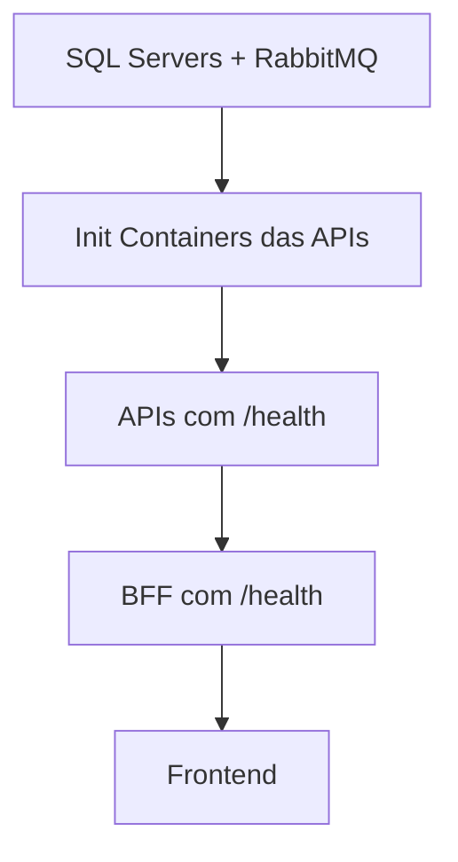

# Peo Platform - Guia Completo Kubernetes

## 🎯 **Visão Geral**

Esta documentação contém todos os manifestos necessários para executar a plataforma Peo no Kubernetes, implementando o padrão **"Database per Service"** com instâncias SQL Server dedicadas para cada microserviço, proporcionando isolamento completo de dados e escalabilidade independente.

## 🏗️ **Arquitetura de Database per Service**

### 🔗 **Dependências entre Pods**
O deploy está configurado com **dependências rigorosas** usando **Init Containers**:



**Ordem garantida:**
1. **Infraestrutura:** SQL Servers + RabbitMQ sobem primeiro
2. **APIs:** Só iniciam após suas dependências (banco + RabbitMQ) 
3. **BFF:** Só inicia após todas as APIs responderem `/health`
4. **Frontend:** Só inicia após BFF responder `/health`

**📋 Ver guia completo:** [POD-DEPENDENCIES-GUIDE.md](./k8s/POD-DEPENDENCIES-GUIDE.md)

### 🗄️ **Instâncias de Banco de Dados:**
| Serviço | Host Interno | Port Externo | Database | PVC |
|---------|-------------|--------------|----------|-----|
| **Identity** | peo-identity-sqlserver | 31433 | identity-db | identity-sqlserver-pvc |
| **Faturamento** | peo-faturamento-sqlserver | 31434 | faturamento-db | faturamento-sqlserver-pvc |
| **Gestão Alunos** | peo-gestaoalunos-sqlserver | 31435 | gestao-alunos-db | gestaoalunos-sqlserver-pvc |
| **Gestão Conteúdo** | peo-gestaoconteudo-sqlserver | 31436 | gestao-conteudo-db | gestaoconteudo-sqlserver-pvc |

## 📋 **Pré-requisitos**

- **Kubernetes cluster** (local: minikube, Docker Desktop, kind)
- **kubectl** configurado e conectado ao cluster
- **Docker** para build das imagens
- **Kustomize** (incluído no kubectl v1.14+)

## 🚀 **Deploy com imagens do container registry público (DockerHub)**

URL: https://hub.docker.com/repositories/jonataspc?search=peo

```bash
# Deploy usando Kustomize
kubectl apply -k devops/k8s-production/

# Verificar ordem de inicialização com dependências
kubectl get pods -n peo-platform-production -w

# Ver logs dos init containers (exemplo)
kubectl logs peo-identity-api-<pod-id> -c wait-for-dependencies -n peo-platform-production
kubectl logs peo-bff-<pod-id> -c wait-for-apis -n peo-platform-production
kubectl logs peo-frontend-<pod-id> -c wait-for-bff -n peo-platform-production
```

## 🚀 **Deploy com imagens locais (ambiente de desenvolvimento)**

```bash
# Build imagens primeiro
docker build -t peo-identity-api:latest -f src/Peo.Identity.WebApi/Dockerfile .
docker build -t peo-gestaoconteudo-api:latest -f src/Peo.GestaoConteudo.WebApi/Dockerfile .
docker build -t peo-gestaoalunos-api:latest -f src/Peo.GestaoAlunos.WebApi/Dockerfile .
docker build -t peo-faturamento-api:latest -f src/Peo.Faturamento.WebApi/Dockerfile .
docker build -t peo-bff:latest -f src/Peo.Web.Bff/Dockerfile .
docker build -t peo-frontend:latest -f src/Peo.Web.Spa/Dockerfile .

# Deploy usando Kustomize
kubectl apply -k devops/k8s/

# Verificar ordem de inicialização com dependências
kubectl get pods -n peo-platform -w

# Ver logs dos init containers (exemplo)
kubectl logs peo-identity-api-<pod-id> -c wait-for-dependencies -n peo-platform
kubectl logs peo-bff-<pod-id> -c wait-for-apis -n peo-platform
kubectl logs peo-frontend-<pod-id> -c wait-for-bff -n peo-platform
```

**URLs após deploy:**
- **Frontend Blazor:** http://localhost:30000
- **BFF API:** http://localhost:30001  
- **RabbitMQ Management:** http://localhost:30002

### **🔗 Zero Falhas de Conectividade**

Com as dependências configuradas:
- ✅ **APIs só sobem** quando bancos e RabbitMQ estão prontos
- ✅ **BFF só sobe** quando todas as APIs respondem `/health`
- ✅ **Frontend só sobe** quando BFF responde `/health`
- ✅ **Sem erros** de "connection refused" durante startup

📋 **Troubleshooting de dependências:** [POD-DEPENDENCIES-GUIDE.md](./k8s/POD-DEPENDENCIES-GUIDE.md)

### **⚠️ Importante: Configuração Multi-Ambiente**
O frontend usa **ConfigMap override** para funcionar em diferentes ambientes sem rebuild:

- **Visual Studio:** `appsettings.Development.json` → BFF em https://localhost:7276
- **Docker Compose:** `appsettings.Production.json` → BFF em http://localhost:5000  
- **Kubernetes:** ConfigMap override → BFF em http://localhost:30001

O ConfigMap `peo-spa-config` sobrescreve a configuração apenas no Kubernetes, mantendo compatibilidade total com outros ambientes.

## 🌐 **URLs de Acesso**

| Serviço | URL | Tipo |
|---------|-----|------|
| **Frontend** | http://localhost:30000 | NodePort |
| **BFF API** | http://localhost:30001 | NodePort |
| **RabbitMQ UI** | http://localhost:30002 | NodePort |

## 🔐 **Credenciais**

### **Aplicação:**
- **Admin:** admin@admin.com / @dmin!

### **RabbitMQ:** 
- **Usuário:** guest / guest (configurável em secrets.yaml)

### **SQL Server (Separadas por Serviço):**
- **Identity DB:** sa / MyStr0ngP@ssw0rd123 (localhost:31433)
- **Faturamento DB:** sa / MyStr0ngP@ssw0rd123 (localhost:31434) 
- **Gestão Alunos DB:** sa / MyStr0ngP@ssw0rd123 (localhost:31435)
- **Gestão Conteúdo DB:** sa / MyStr0ngP@ssw0rd123 (localhost:31436)

## ⚙️ **Configuração**

### **Alterando Senhas (Produção)**
```bash
# 1. Edite devops/k8s/base/secrets.yaml
# 2. Gere novos valores base64:
echo -n "MinhaNovaSenga123!" | base64
echo -n "MeuNovoJWTKey" | base64

# 3. Substitua os valores no arquivo
# 4. Redeploy:
kubectl apply -k devops/k8s/
```

### **Recursos por Pod**
| Serviço | CPU Request | CPU Limit | Memory Request | Memory Limit |
|---------|-------------|-----------|----------------|--------------|
| **Identity SQL Server** | 500m | 2000m | 2Gi | 4Gi |
| **Faturamento SQL Server** | 500m | 2000m | 2Gi | 4Gi |
| **Gestão Alunos SQL Server** | 500m | 2000m | 2Gi | 4Gi |
| **Gestão Conteúdo SQL Server** | 500m | 2000m | 2Gi | 4Gi |
| RabbitMQ | 250m | 500m | 512Mi | 1Gi |
| APIs | 250m | 500m | 256Mi | 512Mi |
| BFF | 250m | 500m | 256Mi | 512Mi |
| Frontend | 100m | 200m | 128Mi | 256Mi |

**⚠️ Requisitos Mínimos do Cluster:**
- **CPU Total:** ~12 cores
- **Memória Total:** ~24GB RAM  
- **Storage:** ~40GB para PVCs (4 instâncias × 10GB cada)

## 📊 **Monitoramento**

### **Status dos Pods**
```bash
# Ver todos os pods
kubectl get pods -n peo-platform

# Ver pods com mais detalhes
kubectl get pods -n peo-platform -o wide

# Ver logs de um pod
kubectl logs -f deployment/peo-identity-api -n peo-platform
```

### **Health Checks**
```bash
# Verificar saúde dos serviços
kubectl get pods -n peo-platform | grep Running

# Port forward para testar APIs localmente
kubectl port-forward svc/peo-bff 5000:80 -n peo-platform
curl http://localhost:5000/health
```

### **Métricas de Recursos**
```bash
# Uso de recursos por pod
kubectl top pods -n peo-platform

# Uso de recursos por node
kubectl top nodes
```

## 🔄 **Operações Comuns**

### **Restart de Serviços**
```bash
# Restart de um deployment específico
kubectl rollout restart deployment/peo-identity-api -n peo-platform

# Restart de todos os deployments
kubectl rollout restart deployment -n peo-platform
```

### **Scaling**
```bash
# Scale horizontal de um serviço
kubectl scale deployment peo-identity-api --replicas=3 -n peo-platform

# Scale de múltiplos serviços
kubectl scale deployment peo-bff peo-frontend --replicas=3 -n peo-platform
```

### **Updates de Imagem**
```bash
# Update de imagem específica
kubectl set image deployment/peo-identity-api identity-api=peo-identity-api:v2.0.0 -n peo-platform

# Verificar status do rollout
kubectl rollout status deployment/peo-identity-api -n peo-platform
```

## 🐛 **Troubleshooting**

### **Pod não inicia**
```bash
# Ver eventos do pod
kubectl describe pod <pod-name> -n peo-platform

# Ver logs detalhados
kubectl logs <pod-name> -n peo-platform --previous
```

### **Problemas de conectividade**
```bash
# Testar DNS interno
kubectl exec -it <pod-name> -n peo-platform -- nslookup peo-bff

# Testar conectividade entre serviços
kubectl exec -it <pod-name> -n peo-platform -- wget -O- http://peo-identity-api/health
```

### **Problemas de banco de dados**
```bash
# Conectar ao Identity SQL Server
kubectl exec -it deployment/peo-identity-sqlserver -n peo-platform -- /opt/mssql-tools18/bin/sqlcmd -S localhost -U sa -P 'MyStr0ngP@ssw0rd123' -C

# Conectar ao Faturamento SQL Server  
kubectl exec -it deployment/peo-faturamento-sqlserver -n peo-platform -- /opt/mssql-tools18/bin/sqlcmd -S localhost -U sa -P 'MyStr0ngP@ssw0rd123' -C

# Conectar ao Gestão Alunos SQL Server
kubectl exec -it deployment/peo-gestaoalunos-sqlserver -n peo-platform -- /opt/mssql-tools18/bin/sqlcmd -S localhost -U sa -P 'MyStr0ngP@ssw0rd123' -C

# Conectar ao Gestão Conteúdo SQL Server
kubectl exec -it deployment/peo-gestaoconteudo-sqlserver -n peo-platform -- /opt/mssql-tools18/bin/sqlcmd -S localhost -U sa -P 'MyStr0ngP@ssw0rd123' -C

# Verificar logs das instâncias SQL Server separadamente
kubectl logs deployment/peo-identity-sqlserver -n peo-platform
kubectl logs deployment/peo-faturamento-sqlserver -n peo-platform
kubectl logs deployment/peo-gestaoalunos-sqlserver -n peo-platform
kubectl logs deployment/peo-gestaoconteudo-sqlserver -n peo-platform

# Port-forward para acesso externo (desenvolvimento)
kubectl port-forward svc/peo-identity-sqlserver-external 1433:1433 -n peo-platform
kubectl port-forward svc/peo-faturamento-sqlserver-external 1434:1433 -n peo-platform
kubectl port-forward svc/peo-gestaoalunos-sqlserver-external 1435:1433 -n peo-platform
kubectl port-forward svc/peo-gestaoconteudo-sqlserver-external 1436:1433 -n peo-platform
```

## 🧹 **Limpeza**

```bash
# Remover namespace (remove todos os recursos)
kubectl delete namespace peo-platform

# Remover apenas recursos específicos
kubectl delete -k devops/k8s/

# Limpar imagens Docker locais
docker rmi $(docker images 'peo-*' -q)
```

## 📈 **Produção**

### **Considerações para Produção**

1. **🏷️ Registry de Imagens:**
   - Publique imagens em um registry (Docker Hub, ACR, ECR)
   - Atualize `kustomization.yaml` com as URLs corretas

2. **🔒 Secrets:**
   - Use ferramentas como Sealed Secrets ou External Secrets
   - Nunca commite secrets em plain text

3. **💾 Persistent Volumes:**
   - Configure StorageClass adequada para cada instância
   - Implemente backup automatizado dos 4 PVs separadamente
   - Considere replicação entre zonas para alta disponibilidade

4. **🗄️ Database per Service:**
   - Monitore recursos de cada instância SQL Server independentemente
   - Configure backup/restore por instância
   - Implemente monitoramento específico por domínio de negócio

4. **🌐 Ingress:**
   - Configure um Ingress Controller
   - Use certificados SSL/TLS

5. **📊 Observabilidade:**
   - Implemente logging centralizado (ELK, Loki)
   - Configure monitoramento (Prometheus + Grafana)
   - Adicione tracing distribuído (Jaeger, Zipkin)

### **Exemplo de configuração para produção:**
```yaml
# ingress.yaml
apiVersion: networking.k8s.io/v1
kind: Ingress
metadata:
  name: peo-ingress
  namespace: peo-platform
spec:
  rules:
  - host: peo.yourdomain.com
    http:
      paths:
      - path: /
        pathType: Prefix
        backend:
          service:
            name: peo-frontend
            port:
              number: 80
      - path: /api
        pathType: Prefix
        backend:
          service:
            name: peo-bff
            port:
              number: 80
```

## 🔄 **CI/CD Integration**

Para integrar com pipelines CI/CD, use os manifestos como base e automatize o deploy:

```yaml
# Exemplo GitHub Actions
- name: Deploy to K8s
  run: |
    kubectl apply -k devops/k8s/
    kubectl rollout status deployment -n peo-platform
```
