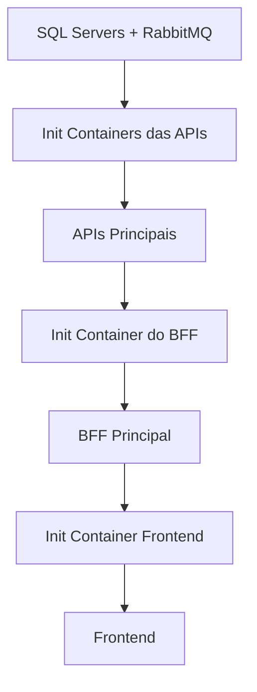

# Dependências entre Pods no Kubernetes

## **Visão Geral**

O deploy do Kubernetes está configurado com **dependências rigorosas** entre os pods para garantir a ordem correta de inicialização e evitar falhas de conectividade durante o startup.

## **Fluxo de Dependências**



### **Ordem de Inicialização:**

1. **Infraestrutura (Sem dependências)**
   - `peo-identity-sqlserver`
   - `peo-faturamento-sqlserver`
   - `peo-gestaoalunos-sqlserver`
   - `peo-gestaoconteudo-sqlserver`
   - `peo-rabbitmq`

2. **Init Containers das APIs (Aguardam infraestrutura)**
   - Cada API testa conectividade com seu SQL Server específico
   - Todas as APIs testam conectividade com RabbitMQ
   - Só permitem a API iniciar quando dependências estão prontas

3. **APIs Principais (Após init containers)**
   - `peo-identity-api`
   - `peo-faturamento-api`
   - `peo-gestaoalunos-api`
   - `peo-gestaoconteudo-api`

4. **BFF (Aguarda todas as APIs)**
   - Init container testa health check de cada API: `/health`
   - Só inicia quando todas as 4 APIs respondem com status 200

5. **Frontend (Aguarda BFF)**
   - Init container testa health check do BFF: `/health`
   - Só inicia quando BFF responde com status 200

## **Configuração de Dependências por Serviço**

### **APIs: SQL Server + RabbitMQ**

| API | Aguarda SQL Server | Aguarda RabbitMQ | Init Container |
|-----|-------------------|------------------|----------------|
| **Identity** | peo-identity-sqlserver:1433 | peo-rabbitmq:5672 | `mcr.microsoft.com/mssql-tools:latest` |
| **Faturamento** | peo-faturamento-sqlserver:1433 | peo-rabbitmq:5672 | `mcr.microsoft.com/mssql-tools:latest` |
| **Gestão Alunos** | peo-gestaoalunos-sqlserver:1433 | peo-rabbitmq:5672 | `mcr.microsoft.com/mssql-tools:latest` |
| **Gestão Conteúdo** | peo-gestaoconteudo-sqlserver:1433 | peo-rabbitmq:5672 | `mcr.microsoft.com/mssql-tools:latest` |

**Comando de teste:**
```bash
# SQL Server
/opt/mssql-tools18/bin/sqlcmd -S <server> -U sa -P "${SA_PASSWORD}" -Q "SELECT 1" -C -N -l 1 -t 1

# RabbitMQ
nc -z peo-rabbitmq 5672
```

### **BFF: Todas as APIs**

| Serviço | Health Check URL | Init Container |
|---------|-----------------|----------------|
| **Identity API** | http://peo-identity-api/health | `curlimages/curl:latest` |
| **Faturamento API** | http://peo-faturamento-api/health | `curlimages/curl:latest` |
| **Gestão Alunos API** | http://peo-gestaoalunos-api/health | `curlimages/curl:latest` |
| **Gestão Conteúdo API** | http://peo-gestaoconteudo-api/health | `curlimages/curl:latest` |

**Comando de teste:**
```bash
curl -f http://<api-service>/health
```

### **Frontend: BFF**

| Serviço | Health Check URL | Init Container |
|---------|-----------------|----------------|
| **BFF** | http://peo-bff/health | `curlimages/curl:latest` |

## **Configuração dos Health Checks**

### **ServiceDefaults Configuration**
```csharp
// Habilita health checks em Development OU quando explicitamente configurado
var enableHealthChecks = app.Environment.IsDevelopment() || 
                        Environment.GetEnvironmentVariable("ENABLE_HEALTH_CHECKS")?.ToLowerInvariant() == "true";

if (enableHealthChecks)
{
    app.MapHealthChecks("/health");
    app.MapHealthChecks("/alive");
}
```

### **Environment Variables**
```yaml
# Em todas as APIs e BFF
- name: ENABLE_HEALTH_CHECKS
  value: "true"  # Habilita endpoints /health em Production
```

### **Endpoints Disponíveis**
- `GET /health` - Health check completo
- `GET /alive` - Liveness check (apenas self)
